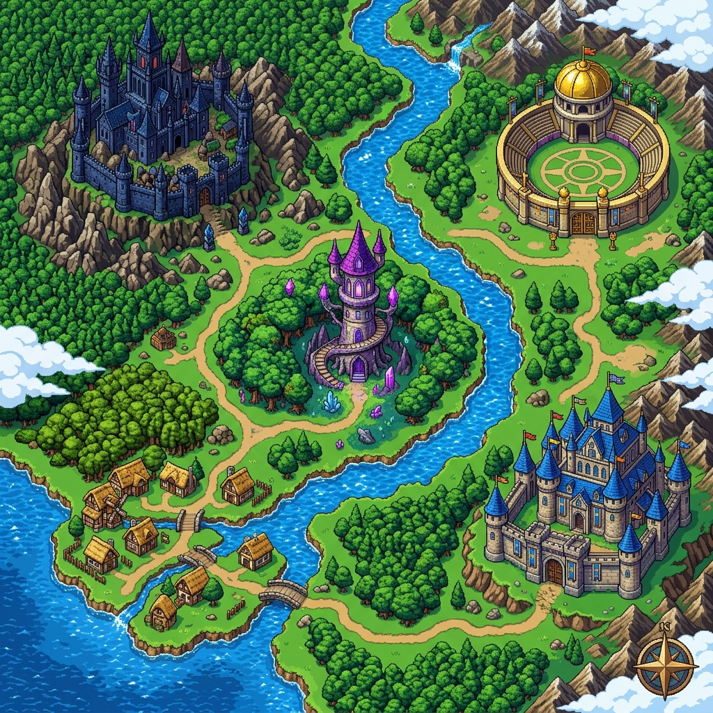

# Nimra Wani | Game Portfolio 🎮

An immersive, RPG-style gamified portfolio experience showcasing full-stack and AI/ML projects. Built with a focus on interactive storytelling and modern web aesthetics.

**Live Demo:** [https://nimrawani.vercel.app/](https://nimrawani.vercel.app/)



## 🌟 Overview

This portfolio transforms the traditional resume into an interactive quest. Users explore a vibrant pixel-art world to discover projects, achievements, and educational background. The experience is designed to be engaging, rewarding, and visually stunning.

## ✨ Key Features

### 🗺️ Gamified Navigation
- **World Map:** A non-linear exploration hub where you can travel to different "zones" like Projects, Experience, and Education.
- **Landing Hub:** A cinematic entry point that sets the stage for the adventure.

### 📜 Quest Board (Projects)
- **Horizontal Carousel:** A smooth, interactive carousel displaying projects as "Quests".
- **Detailed Insights:** Each project page features in-depth descriptions, tech stacks, and direct links to live demos and repositories.

### 📈 Progression System
- **XP & Leveling:** Earn Experience Points (XP) by exploring the world and viewing projects.
- **Coins:** Collect coins as rewards for your curiosity.
- **Achievements:** Unlock special badges (e.g., "Master Explorer", "Viewed All Projects") that track your progress.

### 👤 Character System
- **Character Customization:** Choose your avatar sprite to represent you in the world.
- **Persistent State:** Your progress, selected character, and unlocked achievements are saved locally.

### 🎧 Immersive Atmosphere
- **SFX & Music:** Dynamic sound effects and background music (togglable) to enhance the game-like feel.
- **Micro-animations:** Built with Framer Motion for smooth transitions and interactive feedback.
- **Responsive Layout:** Optimized for a seamless experience across desktop, tablet, and mobile devices.

## 🛠️ Tech Stack

- **Framework:** [React](https://reactjs.org/) (Vite)
- **Animations:** [Framer Motion](https://www.framer.com/motion/)
- **Styling:** Vanilla CSS (Custom modern design system)
- **Icons:** [React Icons](https://react-icons.github.io/react-icons/)
- **State Management:** React Hooks & Local Storage

## 🚀 Getting Started

To run this project locally, follow these steps:

1. **Clone the repository:**
   ```bash
   git clone https://github.com/nimrawani04/nimrawani04.github.io.git
   ```

2. **Navigate to the project directory:**
   ```bash
   cd nimrawani04.github.io
   ```

3. **Install dependencies:**
   ```bash
   npm install
   ```

4. **Start the development server:**
   ```bash
   npm run dev
   ```

5. **Open in browser:**
   Navigate to `http://localhost:5173`

## 📁 Project Structure

```
├── public/          # Static assets (images, sprites, sounds)
├── src/
│   ├── components/  # Modular UI components (WorldScreen, ProjectScreen, etc.)
│   ├── css/         # Modular CSS files
│   ├── data.js      # Project and achievement data
│   ├── utils/       # Helper functions (audio, storage)
│   ├── App.jsx      # Main application logic and routing
│   └── main.jsx     # Entry point
└── index.html       # HTML template and SEO meta tags
```

---

Built with ❤️ by [Nimra Wani](https://github.com/nimrawani04)
