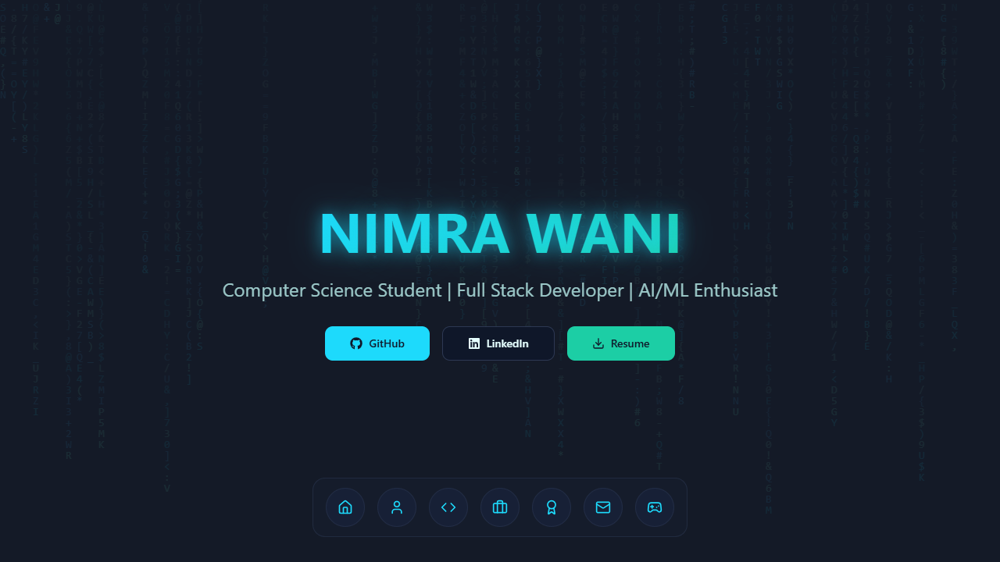
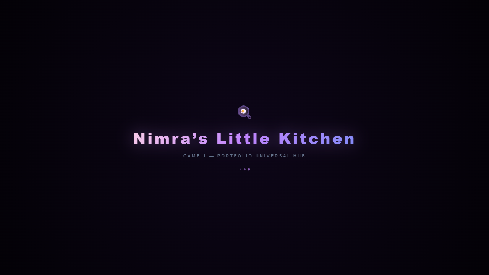
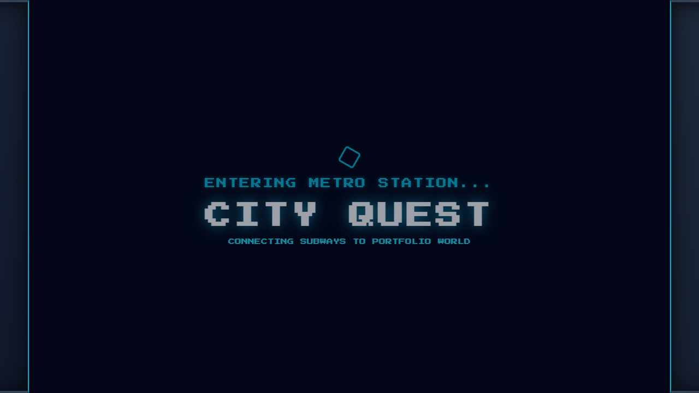
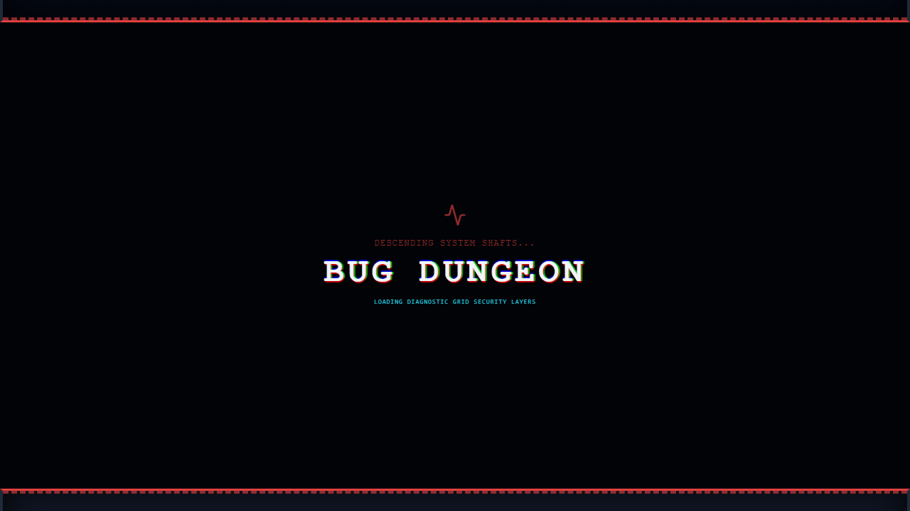
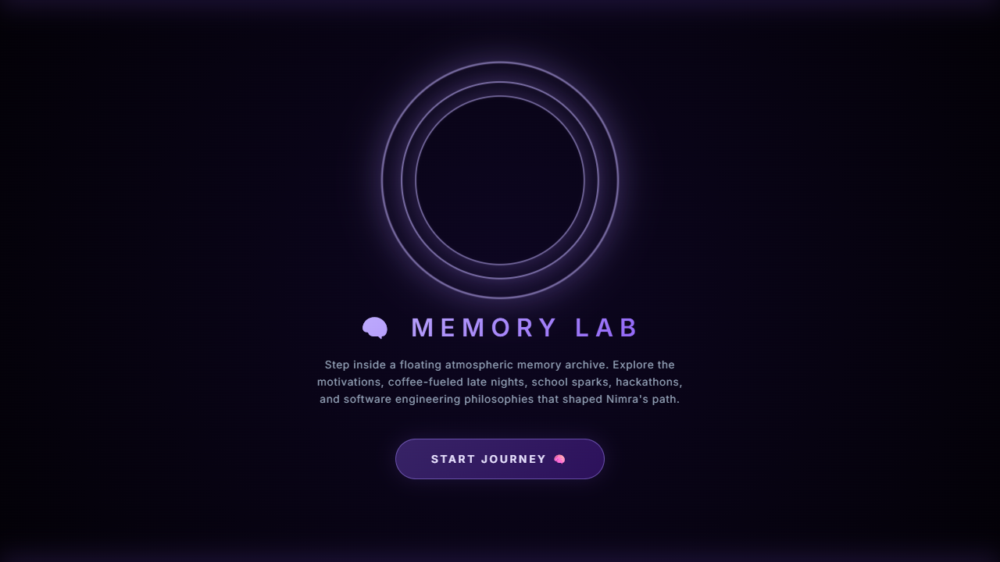
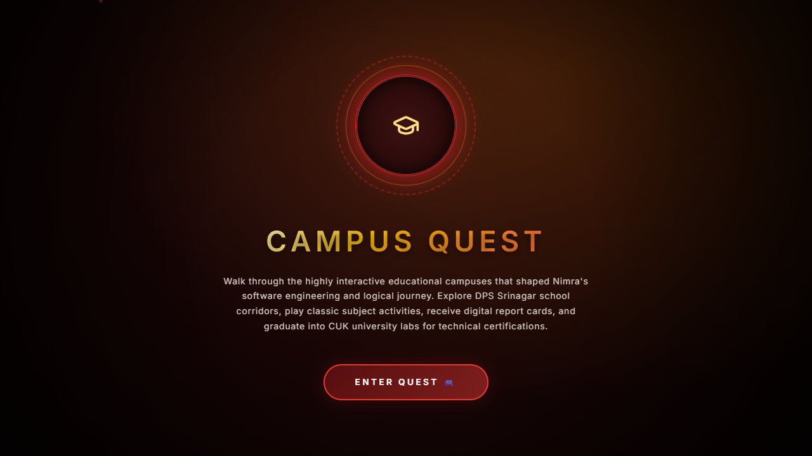

# Nimra Wani — Interactive Portfolio

A modern interactive developer portfolio that combines software engineering, immersive storytelling, and game-inspired digital experiences into a single web platform.

🌐 **Live Website:** https://nimrawani.vercel.app

---

# 🖼️ Main Portfolio



The main portfolio experience features a modern glassmorphism-inspired interface with smooth animations, immersive transitions, and interactive navigation systems designed to create a cinematic developer showcase.

### Highlights

* Modern responsive UI with smooth transitions and animations
* Interactive navigation and immersive user experience
* Dynamic visual effects and game-inspired design system
* Professional project, achievement, and education showcase

---

# 🎮 Interactive Experiences

## 🍳 Kitchen Simulator

An interactive cooking-themed portfolio where projects are presented as recipes and technologies become ingredients inside a stylized kitchen environment.



### Highlights

* Explore tech stack ingredients placed across shelves and cabinets
* Prepare featured projects as interactive dishes and recipes
* Dynamic cooking interactions with animated flames, utensils, and effects

---

## 🚗 City Quest

A neon open-world driving experience where achievements, certifications, and milestones are discovered throughout different city districts.



### Highlights

* Drive through a stylized arcade-inspired neon city
* Discover achievement checkpoints and hidden milestones
* Interactive vehicle selection and customization system

---

## 🧩 Bug Dungeon

A retro-inspired underground debugging world focused on logic challenges and problem-solving experiences.



### Highlights

* Solve interactive coding and debugging puzzles
* Explore a futuristic mechanical dungeon environment
* Unlock development stories and challenge logs

---

## 🧠 Memory Lab

A cinematic narrative experience that presents development journeys and creative growth through immersive floating memory spaces.



### Highlights

* Explore themed floating memory rooms
* Interactive storytelling through environmental objects
* Cinematic atmosphere with animated visual effects

---

## 🏫 Education Campus

A gamified academic world designed to showcase coursework, certifications, and educational progression.



### Highlights

* Interactive academic progression experience
* Scrollable certification and achievement dashboards
* Structured semester and milestone exploration

---

# ✨ Features

* Interactive game-inspired portfolio experience
* Responsive modern UI with smooth animations
* Multiple immersive portfolio worlds
* Dynamic transitions and cinematic effects
* Gamified project and achievement exploration
* Mobile-friendly optimized performance

---

# 🛠️ Tech Stack

* React
* TypeScript
* Tailwind CSS
* Framer Motion
* Vite
* GSAP
* Three.js
* Vercel

---

# 🚀 Run Locally

### 1. Clone the repository

```bash id="a19sk2"
git clone https://github.com/nimrawani04/nimrawani04.github.io.git
```

### 2. Navigate to the project folder

```bash id="ls81qp"
cd nimrawani04.github.io
```

### 3. Install dependencies

```bash id="m29xla"
npm install
```

### 4. Start the development server

```bash id="q17zpt"
npm run dev
```

### 5. Open in browser

Visit:

```bash id="vt63qn"
http://localhost:5173
```
